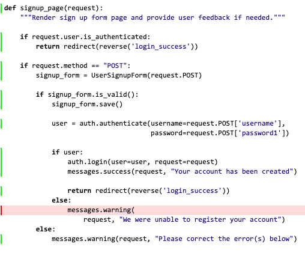
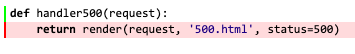

# Testing File

Back to [README.md](../README.md)

## Table of Contents

1. [Automated Tests](#automated-tests)
    - [Code quality](#code-quality)
    - [Python](#python)
    - [JS](#js)
    - [Travis](#travis)

2. [Manual tests](#manual-tests)
    - [User stories](#user-stories)
    - [Features](#features)
    - [Compatibility & Responsiveness](#compatibility)

3. [Known issues](#known-issues)
    - [Solved](#solved)
    - [Unsolved](#unsolved)

<a name="automated-tests"/>

## Automated Tests

<a name="code-quality"/>

### Code quality

- [W3C Markup Validation](https://validator.w3.org/) was used to check the code quality for HTML files.
- [W3C CSS validation](https://jigsaw.w3.org/css-validator/) was used to check the code quality for CSS files.
- [JSHint](https://jshint.com/) was used to check the code quality for JS files.
    - The following undefined variables were reported but they are all related to the use of APIs: emailjs, google, stripe, csrftoken, swal.
    - There are two syntax warnings related to the use of syntax only available in ES6.
- I used Visual Studio Code extension for Python available in Gitpod to ensure the code quality of my Python files. 

<a name="python"/>

### Python

I have tested my Python files using Django test framework that is built on unittest. For each app, I have created a tests folder in which I have tested - if relevant - the following files:
- urls.py
- views.py
- models.py
- forms.py

#### How to run Python tests

1. Run the following command in the terminal: `python3 manage.py test`
2. If you want to only run test for a specific app, then you can run the following command: `python3 manage.py test <app_name>`
3. In the terminal, you should view how many tests have run and the time it took to run those tests. 

#### Coverage

1. Run the following command in the terminal: `coverage run --source='.' manage.py test`
2. If you want to only run test coverage for a specific app, then you can run the following command: `coverage run --source='<app_name>' manage.py test <app_name>`
3. Then, to view the coverage report in the terminal, run the following command: `coverage report`
4. If you would like to have details about code coverage for a specific file you can:
    1. first run: `coverage html`
        It should create a folder called 'htmlcov'
    2. then run: `python3 -m http.server`
        You should be able to open the folder 'htmlcov' and then check in details for each python files the coverage.

I have managed to achieve a coverage of **95%** on my project. I have **127 tests** that are all passing.

Click here to view full coverage report

    <table class="index">
        <thead>
            <tr class="tablehead" title="Click to sort">
                <th class="name left headerSortDown shortkey_n header">Module</th>
                <th class="shortkey_s header">statements</th>
                <th class="shortkey_m header">missing</th>
                <th class="shortkey_x header">excluded</th>
                <th class="right shortkey_c header">coverage</th>
            </tr>
        </thead>
        <tfoot>
            <tr class="total">
                <td class="name left">Total</td>
                <td>1694</td>
                <td>83</td>
                <td>0</td>
                <td class="right" data-ratio="1611 1694">95%</td>
            </tr><tr class="total_dynamic hidden">
                <td class="name left">Total</td>
                <td>1694</td>
                <td>83</td>
                <td>0</td>
                <td class="right" data-ratio="1611 1694">95%</td>
            </tr>
        </tfoot>
        <tbody>
            <tr class="file">
                <td class="name left"><a href="accounts___init___py.html">accounts/__init__.py</a></td>
                <td>0</td>
                <td>0</td>
                <td>0</td>
                <td class="right" data-ratio="0 0">100%</td>
            </tr>
            <tr class="file">
                <td class="name left"><a href="accounts_admin_py.html">accounts/admin.py</a></td>
                <td>10</td>
                <td>0</td>
                <td>0</td>
                <td class="right" data-ratio="10 10">100%</td>
            </tr>
            <tr class="file">
                <td class="name left"><a href="accounts_apps_py.html">accounts/apps.py</a></td>
                <td>4</td>
                <td>4</td>
                <td>0</td>
                <td class="right" data-ratio="0 4">0%</td>
            </tr>
            <tr class="file">
                <td class="name left"><a href="accounts_forms_py.html">accounts/forms.py</a></td>
                <td>35</td>
                <td>0</td>
                <td>0</td>
                <td class="right" data-ratio="35 35">100%</td>
            </tr>
            <tr class="file">
                <td class="name left"><a href="accounts_migrations_0001_initial_py.html">accounts/migrations/0001_initial.py</a></td>
                <td>8</td>
                <td>0</td>
                <td>0</td>
                <td class="right" data-ratio="8 8">100%</td>
            </tr>
            <tr class="file">
                <td class="name left"><a href="accounts_migrations___init___py.html">accounts/migrations/__init__.py</a></td>
                <td>0</td>
                <td>0</td>
                <td>0</td>
                <td class="right" data-ratio="0 0">100%</td>
            </tr>
            <tr class="file">
                <td class="name left"><a href="accounts_models_py.html">accounts/models.py</a></td>
                <td>33</td>
                <td>0</td>
                <td>0</td>
                <td class="right" data-ratio="33 33">100%</td>
            </tr>
            <tr class="file">
                <td class="name left"><a href="accounts_tests___init___py.html">accounts/tests/__init__.py</a></td>
                <td>0</td>
                <td>0</td>
                <td>0</td>
                <td class="right" data-ratio="0 0">100%</td>
            </tr>
            <tr class="file">
                <td class="name left"><a href="accounts_tests_tests_forms_py.html">accounts/tests/tests_forms.py</a></td>
                <td>44</td>
                <td>0</td>
                <td>0</td>
                <td class="right" data-ratio="44 44">100%</td>
            </tr>
            <tr class="file">
                <td class="name left"><a href="accounts_tests_tests_models_py.html">accounts/tests/tests_models.py</a></td>
                <td>24</td>
                <td>0</td>
                <td>0</td>
                <td class="right" data-ratio="24 24">100%</td>
            </tr>
            <tr class="file">
                <td class="name left"><a href="accounts_tests_tests_urls_py.html">accounts/tests/tests_urls.py</a></td>
                <td>34</td>
                <td>0</td>
                <td>0</td>
                <td class="right" data-ratio="34 34">100%</td>
            </tr>
            <tr class="file">
                <td class="name left"><a href="accounts_tests_tests_views_py.html">accounts/tests/tests_views.py</a></td>
                <td>241</td>
                <td>0</td>
                <td>0</td>
                <td class="right" data-ratio="241 241">100%</td>
            </tr>
            <tr class="file">
                <td class="name left"><a href="accounts_urls_py.html">accounts/urls.py</a></td>
                <td>4</td>
                <td>0</td>
                <td>0</td>
                <td class="right" data-ratio="4 4">100%</td>
            </tr>
            <tr class="file">
                <td class="name left"><a href="accounts_urls_profile_py.html">accounts/urls_profile.py</a></td>
                <td>3</td>
                <td>0</td>
                <td>0</td>
                <td class="right" data-ratio="3 3">100%</td>
            </tr>
            <tr class="file">
                <td class="name left"><a href="accounts_urls_reset_py.html">accounts/urls_reset.py</a></td>
                <td>3</td>
                <td>0</td>
                <td>0</td>
                <td class="right" data-ratio="3 3">100%</td>
            </tr>
            <tr class="file">
                <td class="name left"><a href="accounts_views_py.html">accounts/views.py</a></td>
                <td>123</td>
                <td>1</td>
                <td>0</td>
                <td class="right" data-ratio="122 123">99%</td>
            </tr>
            <tr class="file">
                <td class="name left"><a href="cart___init___py.html">cart/__init__.py</a></td>
                <td>0</td>
                <td>0</td>
                <td>0</td>
                <td class="right" data-ratio="0 0">100%</td>
            </tr>
            <tr class="file">
                <td class="name left"><a href="cart_admin_py.html">cart/admin.py</a></td>
                <td>1</td>
                <td>0</td>
                <td>0</td>
                <td class="right" data-ratio="1 1">100%</td>
            </tr>
            <tr class="file">
                <td class="name left"><a href="cart_apps_py.html">cart/apps.py</a></td>
                <td>3</td>
                <td>3</td>
                <td>0</td>
                <td class="right" data-ratio="0 3">0%</td>
            </tr>
            <tr class="file">
                <td class="name left"><a href="cart_contexts_py.html">cart/contexts.py</a></td>
                <td>15</td>
                <td>0</td>
                <td>0</td>
                <td class="right" data-ratio="15 15">100%</td>
            </tr>
            <tr class="file">
                <td class="name left"><a href="cart_migrations___init___py.html">cart/migrations/__init__.py</a></td>
                <td>0</td>
                <td>0</td>
                <td>0</td>
                <td class="right" data-ratio="0 0">100%</td>
            </tr>
            <tr class="file">
                <td class="name left"><a href="cart_models_py.html">cart/models.py</a></td>
                <td>1</td>
                <td>0</td>
                <td>0</td>
                <td class="right" data-ratio="1 1">100%</td>
            </tr>
            <tr class="file">
                <td class="name left"><a href="cart_tests___init___py.html">cart/tests/__init__.py</a></td>
                <td>0</td>
                <td>0</td>
                <td>0</td>
                <td class="right" data-ratio="0 0">100%</td>
            </tr>
            <tr class="file">
                <td class="name left"><a href="cart_tests_tests_contexts_py.html">cart/tests/tests_contexts.py</a></td>
                <td>16</td>
                <td>0</td>
                <td>0</td>
                <td class="right" data-ratio="16 16">100%</td>
            </tr>
            <tr class="file">
                <td class="name left"><a href="cart_tests_tests_urls_py.html">cart/tests/tests_urls.py</a></td>
                <td>16</td>
                <td>0</td>
                <td>0</td>
                <td class="right" data-ratio="16 16">100%</td>
            </tr>
            <tr class="file">
                <td class="name left"><a href="cart_tests_tests_views_py.html">cart/tests/tests_views.py</a></td>
                <td>83</td>
                <td>0</td>
                <td>0</td>
                <td class="right" data-ratio="83 83">100%</td>
            </tr>
            <tr class="file">
                <td class="name left"><a href="cart_urls_py.html">cart/urls.py</a></td>
                <td>3</td>
                <td>0</td>
                <td>0</td>
                <td class="right" data-ratio="3 3">100%</td>
            </tr>
            <tr class="file">
                <td class="name left"><a href="cart_views_py.html">cart/views.py</a></td>
                <td>37</td>
                <td>1</td>
                <td>0</td>
                <td class="right" data-ratio="36 37">97%</td>
            </tr>
            <tr class="file">
                <td class="name left"><a href="checkout___init___py.html">checkout/__init__.py</a></td>
                <td>0</td>
                <td>0</td>
                <td>0</td>
                <td class="right" data-ratio="0 0">100%</td>
            </tr>
            <tr class="file">
                <td class="name left"><a href="checkout_admin_py.html">checkout/admin.py</a></td>
                <td>10</td>
                <td>0</td>
                <td>0</td>
                <td class="right" data-ratio="10 10">100%</td>
            </tr>
            <tr class="file">
                <td class="name left"><a href="checkout_apps_py.html">checkout/apps.py</a></td>
                <td>3</td>
                <td>3</td>
                <td>0</td>
                <td class="right" data-ratio="0 3">0%</td>
            </tr>
            <tr class="file">
                <td class="name left"><a href="checkout_forms_py.html">checkout/forms.py</a></td>
                <td>23</td>
                <td>0</td>
                <td>0</td>
                <td class="right" data-ratio="23 23">100%</td>
            </tr>
            <tr class="file">
                <td class="name left"><a href="checkout_migrations_0001_initial_py.html">checkout/migrations/0001_initial.py</a></td>
                <td>8</td>
                <td>0</td>
                <td>0</td>
                <td class="right" data-ratio="8 8">100%</td>
            </tr>
            <tr class="file">
                <td class="name left"><a href="checkout_migrations___init___py.html">checkout/migrations/__init__.py</a></td>
                <td>0</td>
                <td>0</td>
                <td>0</td>
                <td class="right" data-ratio="0 0">100%</td>
            </tr>
            <tr class="file">
                <td class="name left"><a href="checkout_models_py.html">checkout/models.py</a></td>
                <td>30</td>
                <td>0</td>
                <td>0</td>
                <td class="right" data-ratio="30 30">100%</td>
            </tr>
            <tr class="file">
                <td class="name left"><a href="checkout_tests___init___py.html">checkout/tests/__init__.py</a></td>
                <td>0</td>
                <td>0</td>
                <td>0</td>
                <td class="right" data-ratio="0 0">100%</td>
            </tr>
            <tr class="file">
                <td class="name left"><a href="checkout_tests_tests_models_py.html">checkout/tests/tests_models.py</a></td>
                <td>24</td>
                <td>0</td>
                <td>0</td>
                <td class="right" data-ratio="24 24">100%</td>
            </tr>
            <tr class="file">
                <td class="name left"><a href="checkout_tests_tests_urls_py.html">checkout/tests/tests_urls.py</a></td>
                <td>22</td>
                <td>0</td>
                <td>0</td>
                <td class="right" data-ratio="22 22">100%</td>
            </tr>
            <tr class="file">
                <td class="name left"><a href="checkout_tests_tests_views_py.html">checkout/tests/tests_views.py</a></td>
                <td>213</td>
                <td>0</td>
                <td>0</td>
                <td class="right" data-ratio="213 213">100%</td>
            </tr>
            <tr class="file">
                <td class="name left"><a href="checkout_urls_py.html">checkout/urls.py</a></td>
                <td>3</td>
                <td>0</td>
                <td>0</td>
                <td class="right" data-ratio="3 3">100%</td>
            </tr>
            <tr class="file">
                <td class="name left"><a href="checkout_views_py.html">checkout/views.py</a></td>
                <td>147</td>
                <td>24</td>
                <td>0</td>
                <td class="right" data-ratio="123 147">84%</td>
            </tr>
            <tr class="file">
                <td class="name left"><a href="custom_storages_py.html">custom_storages.py</a></td>
                <td>6</td>
                <td>6</td>
                <td>0</td>
                <td class="right" data-ratio="0 6">0%</td>
            </tr>
            <tr class="file">
                <td class="name left"><a href="env_py.html">env.py</a></td>
                <td>12</td>
                <td>0</td>
                <td>0</td>
                <td class="right" data-ratio="12 12">100%</td>
            </tr>
            <tr class="file">
                <td class="name left"><a href="main_pages___init___py.html">main_pages/__init__.py</a></td>
                <td>0</td>
                <td>0</td>
                <td>0</td>
                <td class="right" data-ratio="0 0">100%</td>
            </tr>
            <tr class="file">
                <td class="name left"><a href="main_pages_admin_py.html">main_pages/admin.py</a></td>
                <td>1</td>
                <td>0</td>
                <td>0</td>
                <td class="right" data-ratio="1 1">100%</td>
            </tr>
            <tr class="file">
                <td class="name left"><a href="main_pages_apps_py.html">main_pages/apps.py</a></td>
                <td>3</td>
                <td>3</td>
                <td>0</td>
                <td class="right" data-ratio="0 3">0%</td>
            </tr>
            <tr class="file">
                <td class="name left"><a href="main_pages_forms_py.html">main_pages/forms.py</a></td>
                <td>10</td>
                <td>0</td>
                <td>0</td>
                <td class="right" data-ratio="10 10">100%</td>
            </tr>
            <tr class="file">
                <td class="name left"><a href="main_pages_migrations___init___py.html">main_pages/migrations/__init__.py</a></td>
                <td>0</td>
                <td>0</td>
                <td>0</td>
                <td class="right" data-ratio="0 0">100%</td>
            </tr>
            <tr class="file">
                <td class="name left"><a href="main_pages_models_py.html">main_pages/models.py</a></td>
                <td>1</td>
                <td>0</td>
                <td>0</td>
                <td class="right" data-ratio="1 1">100%</td>
            </tr>
            <tr class="file">
                <td class="name left"><a href="main_pages_tests___init___py.html">main_pages/tests/__init__.py</a></td>
                <td>0</td>
                <td>0</td>
                <td>0</td>
                <td class="right" data-ratio="0 0">100%</td>
            </tr>
            <tr class="file">
                <td class="name left"><a href="main_pages_tests_tests_forms_py.html">main_pages/tests/tests_forms.py</a></td>
                <td>14</td>
                <td>0</td>
                <td>0</td>
                <td class="right" data-ratio="14 14">100%</td>
            </tr>
            <tr class="file">
                <td class="name left"><a href="main_pages_tests_tests_urls_py.html">main_pages/tests/tests_urls.py</a></td>
                <td>16</td>
                <td>0</td>
                <td>0</td>
                <td class="right" data-ratio="16 16">100%</td>
            </tr>
            <tr class="file">
                <td class="name left"><a href="main_pages_tests_tests_views_py.html">main_pages/tests/tests_views.py</a></td>
                <td>48</td>
                <td>0</td>
                <td>0</td>
                <td class="right" data-ratio="48 48">100%</td>
            </tr>
            <tr class="file">
                <td class="name left"><a href="main_pages_urls_py.html">main_pages/urls.py</a></td>
                <td>3</td>
                <td>0</td>
                <td>0</td>
                <td class="right" data-ratio="3 3">100%</td>
            </tr>
            <tr class="file">
                <td class="name left"><a href="main_pages_views_py.html">main_pages/views.py</a></td>
                <td>30</td>
                <td>1</td>
                <td>0</td>
                <td class="right" data-ratio="29 30">97%</td>
            </tr>
            <tr class="file">
                <td class="name left"><a href="manage_py.html">manage.py</a></td>
                <td>12</td>
                <td>2</td>
                <td>0</td>
                <td class="right" data-ratio="10 12">83%</td>
            </tr>
            <tr class="file">
                <td class="name left"><a href="spacex___init___py.html">spacex/__init__.py</a></td>
                <td>0</td>
                <td>0</td>
                <td>0</td>
                <td class="right" data-ratio="0 0">100%</td>
            </tr>
            <tr class="file">
                <td class="name left"><a href="spacex_asgi_py.html">spacex/asgi.py</a></td>
                <td>4</td>
                <td>4</td>
                <td>0</td>
                <td class="right" data-ratio="0 4">0%</td>
            </tr>
            <tr class="file">
                <td class="name left"><a href="spacex_settings_py.html">spacex/settings.py</a></td>
                <td>60</td>
                <td>22</td>
                <td>0</td>
                <td class="right" data-ratio="38 60">63%</td>
            </tr>
            <tr class="file">
                <td class="name left"><a href="spacex_urls_py.html">spacex/urls.py</a></td>
                <td>10</td>
                <td>1</td>
                <td>0</td>
                <td class="right" data-ratio="9 10">90%</td>
            </tr>
            <tr class="file">
                <td class="name left"><a href="spacex_wsgi_py.html">spacex/wsgi.py</a></td>
                <td>4</td>
                <td>4</td>
                <td>0</td>
                <td class="right" data-ratio="0 4">0%</td>
            </tr>
            <tr class="file">
                <td class="name left"><a href="trips___init___py.html">trips/__init__.py</a></td>
                <td>0</td>
                <td>0</td>
                <td>0</td>
                <td class="right" data-ratio="0 0">100%</td>
            </tr>
            <tr class="file">
                <td class="name left"><a href="trips_admin_py.html">trips/admin.py</a></td>
                <td>16</td>
                <td>0</td>
                <td>0</td>
                <td class="right" data-ratio="16 16">100%</td>
            </tr>
            <tr class="file">
                <td class="name left"><a href="trips_apps_py.html">trips/apps.py</a></td>
                <td>4</td>
                <td>4</td>
                <td>0</td>
                <td class="right" data-ratio="0 4">0%</td>
            </tr>
            <tr class="file">
                <td class="name left"><a href="trips_forms_py.html">trips/forms.py</a></td>
                <td>13</td>
                <td>0</td>
                <td>0</td>
                <td class="right" data-ratio="13 13">100%</td>
            </tr>
            <tr class="file">
                <td class="name left"><a href="trips_migrations_0001_initial_py.html">trips/migrations/0001_initial.py</a></td>
                <td>7</td>
                <td>0</td>
                <td>0</td>
                <td class="right" data-ratio="7 7">100%</td>
            </tr>
            <tr class="file">
                <td class="name left"><a href="trips_migrations___init___py.html">trips/migrations/__init__.py</a></td>
                <td>0</td>
                <td>0</td>
                <td>0</td>
                <td class="right" data-ratio="0 0">100%</td>
            </tr>
            <tr class="file">
                <td class="name left"><a href="trips_models_py.html">trips/models.py</a></td>
                <td>55</td>
                <td>0</td>
                <td>0</td>
                <td class="right" data-ratio="55 55">100%</td>
            </tr>
            <tr class="file">
                <td class="name left"><a href="trips_tests___init___py.html">trips/tests/__init__.py</a></td>
                <td>0</td>
                <td>0</td>
                <td>0</td>
                <td class="right" data-ratio="0 0">100%</td>
            </tr>
            <tr class="file">
                <td class="name left"><a href="trips_tests_tests_models_py.html">trips/tests/tests_models.py</a></td>
                <td>22</td>
                <td>0</td>
                <td>0</td>
                <td class="right" data-ratio="22 22">100%</td>
            </tr>
            <tr class="file">
                <td class="name left"><a href="trips_tests_tests_urls_py.html">trips/tests/tests_urls.py</a></td>
                <td>19</td>
                <td>0</td>
                <td>0</td>
                <td class="right" data-ratio="19 19">100%</td>
            </tr>
            <tr class="file">
                <td class="name left"><a href="trips_tests_tests_views_py.html">trips/tests/tests_views.py</a></td>
                <td>44</td>
                <td>0</td>
                <td>0</td>
                <td class="right" data-ratio="44 44">100%</td>
            </tr>
            <tr class="file">
                <td class="name left"><a href="trips_urls_py.html">trips/urls.py</a></td>
                <td>3</td>
                <td>0</td>
                <td>0</td>
                <td class="right" data-ratio="3 3">100%</td>
            </tr>
            <tr class="file">
                <td class="name left"><a href="trips_views_py.html">trips/views.py</a></td>
                <td>53</td>
                <td>0</td>
                <td>0</td>
                <td class="right" data-ratio="53 53">100%</td>
            </tr>
        </tbody>
    </table>
    

        No items found using the specified filter.
    

#### Missing automated tests

- accounts/views.py

For the signup_page view, when the form is valid but the user account was not created, the following error message should be displayed: "We were enable to register your account". I was not able to simulate such a database error with unit tests, therefore this block of code is not covered in my python automated tests.

- checkout/views.py

When submitting a valid form for a stripe payment, a stripe id is created and this cannot be simulated by client tests. I have therefore manually tested the checkout_payment_page view in the [manual tests](#manual-tests) section.

- main_pages/views.py

For the handler500 view, as per [Django Ticket #18707](https://code.djangoproject.com/ticket/18707), test client doesn't allow testing of 500 responses content. I have therefore manually tested this view by creating a 500 view with an url (setting must be set to DEBUG=TRUE in settings.py) that would simulate an internal service error.

<a name="js"/>

### JS

For this project, JavaScript was mainly used for DOM manipulation and ajax calls. I have therefore decided to test all these functionalities manually in the [section](#manual-tests) that comes next.

<a name="travis"/>

### Travis

During the entire development of this project, I used [Travis](https://travis-ci.org/) to ensure continuous integration of the deployed site. 

<a name="manual-tests"/>

## Manual tests

<a name="user-stories"/>

### User stories

This project has been tested multiple times against each user stories listed in the UX section of the [README.md](../README.md) file.

**As a user, I expect:**
1. **To have convenient access of all the trips that the travel agency offers.**
    - The user can easily identify the 'Trips' menu in the navigation bar.
    - The user has the option to look for all the trips available by clicking on 'Search all' in the dropdown menu.
    - If the user only wants to look for the type of destination available, (s)he can click on 'Destination' in the dropdown menu. 
2. **The website to have a neat and elegant design with an optimal architecture and layout.**
    - The website is consistent with regards to the design and layout. 
    - All the images are visually impacting and related to astrophysics and space.
3. **The website to be intuitive and easy to navigate so that I can find what I need in the most effective manner.**
    - The website has a simple architecture and is quite intuitive to navigate. 
    - All important pages can be accessed through a fixed navbar that is therefore always available for the user.
    - Some useful links are also available on the footer (trips, scientists and faq).
4. **To easily find information i.e. identify key information for a specific trip and, if needed, be able to get access to more details.**
    - The user can have access to trips presented by destination. Key information is listed in an organized manner: trip destination, trip duration, trip distance...
    - The user can access more details about the destination by clicking on the 'Trip details' button. The user will be able to view more pictures of the destination, with key information, and a detailed trip description. 
5. **To easily find information about the travel company and see their entire range of offers. I also want to have their contact details and be able to get in touch with them through a contact form.**
    - The user can easily access information about the travel company by clicking on the 'About' link in the navbar. On this page, the user will have access to a short presentation of the company along with their history and all the services they provide.
    - The user can get in touch with the company through a contact form available on the 'Contact' page. 
6. **To be able to research trips by destination, departure site and date.**
    - The user can research trips by destination and then on the trip details page, (s)he will have the option to submit a form to look for all the available trips for this specific destination.
    - The user can also research trips in the 'Search all' section. At the top of the results page, there is a search form where the user can look for trips with the following criteria: destination, departure site and departure date. 
7. **To read testimonies from previous passengers and have access to FAQs.**
    - Testimonies from previous passengers are directly available on the home page.
    - A link to the FAQs is available in the 'Trips' dropdown menu in the navbar and in the footer as well. 
8. **To be able to book a trip and then register/log in to an account with minimal steps to confirm my order.**
    - After looking for a trip, the user can easily add the trip to his/her cart. The user will be then redirected to the cart page to view the content of his/her cart. Then, the user will be able to proceed to the checkout by clicking the button at the end of the cart page.
    - If the user is already logged in, (s)he will be able to start the checkout process.
    - Otherwise, the user will be able to log in / register to an account and then be redirected back to the checkout process. 
9. **The website to display my order details for each steps of the checkout and receive an email once my booking has been completed.**
    - For each step of the checkout process, a recap of the user's booking with key information related to the trip(s) is displayed.
    - The different steps of the checkout are very clear and indicated at the top of each page thanks to a progress bar. 
    - SEND EMAIL AFTER BOOKING IS COMPLETED IS TO BE DONE. 
10. **The website to be fully responsive on any devices: mobile, tablet, desktop.**
    - This project has been created to be fully responsive on all devices' size. For each page, the wireframes are available in three sizes.
    - Throughout the developement of this project, it has been extensively tested on mobile, tablet and desktop as well as on other devices screen size available on Chrome Developer Tools. 
11. **The website to be fully interactive so that I get clear feedback on any action I undertake (complete a form, process a payment, log in, log out etc…).**
    - Flash messages were used to provide feedback to the user anytime an action has been triggered by the user leading to be redirected to a different view. Flash messages were used to provide feedback to the user if an action has indeed taken place and the user has been redirected to a different view resulting of this action. 
    - SweetAlert was used to provide feedback thanks to an alert box when the user has requested an action but this action requires a confirmation or just feedback. For instance, when users add a trip to their cart, then they will be asked to confirm if they would like to keep shopping or go to the cart. Also JS was prioritized to provide feedback when the action initiated does imply to be redirected to a different view.
12. As a business or scientist, I want to easily find information on the application process and request information to the company. 
    - Scientists and businesses have a dedicated page available from the navbar by clicking on 'Scientists'. 
    - On this dedicated page, they can find information on the selection process for a scientific experiment, examples of past experiments etc... A link to the contact page is also available on this page.
13. As a user, I want to be able to access (and update) my personal information, upcoming and past bookings.
    - The user has access to their personal information on their 'Profile' page. The user can update their contact details, passenger details as well as their password.
    - The user can access their upcoming or past bookings by clicking on the 'Bookings' link in the 'Account' dropdown menu in the navbar.

<a name="features"/>

### Features

###### Features on every pages

1. Navbar

**Test scenario:**
- [x] Check that the SpaceX logo displays correctly and is aligned to the left.
- [x] Check that each following menu items display correctly and are centered: Home, Trips, Scientists, About, Contact.
- [x] Check that the dropdown menu item for Trips displays the following links: Destinations, Search All, FAQs.
- [x] Check that the following menu items are aligned to the right: Account, Cart icon.
- [x] Confirm that, when the user is not logged in, the dropdown menu item for Account displays the following links: Log in, Sign Up. 
- [x] Confirm that, when the user is logged in, the dropdown menu item for Account displays the following links: Profile, Bookings, Log Out. 
- [x] Hover over each menu items and confirm that the font colour gets slightly highlighted.
- [x] Confirm that for each menu item clicked, it should take the user to the corresponding page. 
- [x] Add a trip to the cart and confirm that the number of booked trip(s) is successfully displayed next to the cart item in the navbar.

**Test result:** Successful :white_check_mark:

*Specific test undertaken for mobile and tablet devices:*

**Test scenario:**
- [x] Open the website on a mobile or a tablet and confirm that the navbar is collapsed into a hamburger button (the logo should still be visible).
- [x] Click on the hamburger button and confirm that the menu items are correctly displayed and that each link refers to the corresponding page. 
- [x] When logged in/out, confirm that you have the expected view.

**Test result:** Successful :white_check_mark:

2. Footer 

**Test scenario:**
- [x] Confirm that the footer is composed of 3 cards: Address, Subscription, Links.
- [x] Confirm that you can subscribe to SpaceX newsletter (after confirmation through Mailchimp).
- [x] Confirm that, when clicked, each link (Trips, Scientists, FAQs) returns to the corresponding page.
- [x] Confirm that the icons in the footer display correctly in the following order: Facebook, Twitter, LinkedIn, YouTube.
- [x] Hover over each icons and confirm that their colour gets slightly highlighted. 
- [x] Click on each social media icon, it should take the user to the corresponding social media page, opening in a new tab. (It takes the user to the home page of each social media as this is a mock project - no account was created).

**Test result:** Successful :white_check_mark:

###### Feature 1 - Home page

**Test scenario:**
- [x] The title and the picture of the welcome section loaded successfully. 
- [x] The navbar should be transparent, when scrolling down, it should turn white.
- [x] 'Discover' button
    - When hovered over, the background color should get darker. 
    - When clicked, it should take the user further down on the home page: where the travel agency is presented.
- [x] Confirm that all the pictures on the home page loaded successfully, including the ones for passengers testimonials. 
- [x] Confirm that the following information is available on the page: 
    - innovative concept of the travel company
    - categories of trips (individuals & scientists)
    - statistics
    - testimonials
    - button to browse trips    
- [x] At the bottom of the home page, get to the 'Book Your Next Trip' button
    - When hovered over, the background color should turn white.
    - When clicked, it should take the user to the page where all the destinations are listed.

**Test result:** Successful :white_check_mark:

###### Feature 2 - About page

**Test scenario:**
- [x] The title and the picture of the header loaded successfully. 
- [x] The navbar should be transparent, when scrolling down, it should turn white.
- [x] Confirm that all the pictures on the page loaded successfully. 
- [x] At the bottom of the page, get to the 'Browse Trips' button
    - When hovered over, the background color should get darker.
    - When clicked, it should take the user to the page where all the destinations are listed. 

**Test result:** Successful :white_check_mark:

###### Feature 3 - Contact page

**Test scenario:**
- [x] The title and the picture of the header loaded successfully. 
- [x] The navbar should be transparent, when scrolling down, it should turn white.
- [x] Confirm that the contact form and the google map loaded successfully.
- [x] As a logged in user, confirm that the following fields of the contact form are already provided: First Name, Last Name and Email.
- [x] Try to submit the form with a missing field and confirm that you get an feedback advising you of the missing field.
- [x] Submit a complete form, you should get an alert box confirming you that the contact form was sent. After closing the alert box, you should get redirected back to the contact page.

**Test result:** Successful :white_check_mark:

###### Feature 4 - Scientists page

**Test scenario:**
- [x] The title and the picture of the header loaded successfully. 
- [x] The navbar should be transparent, when scrolling down, it should turn white.
- [x] Confirm that all the pictures on the page loaded successfully. 
- [x] At the bottom of the page, get to the 'Contact Us' button
    - When hovered over, the background color should get darker.
    - When clicked, it should take the user to the contact page. 

**Test result:** Successful :white_check_mark:

###### Feature 5 - Trips by destination page

**Test scenario:**
- [x] The title and the picture of the header loaded successfully.
- [x] The navbar should be transparent, when scrolling down, it should turn white.
- [x] Click each breadcrumd links, confirm they take the user to the correct corresponding page.
- [x] Confirm that all the pictures on the page loaded successfully. 
- [x] Confirm that the alignment for the destination card alternates according to their index. Ie. cards with an odd index should have the picture and button aligned on the left and the key information aligned to the right. Whereas, for the cards with an even index, it should be the other way around. 
- [x] For each destination, confirm that the following information is provided:
    - trip duration (in days)
    - trip distance (in km)
    - trip price (in euros)
    - departures
    - button to be redirected to the trip details
- [x] For each destination, confirm that the 'Trip Details' button work:
    - When hovered over, the background color should get darker.
    - When clicked, it should take the user to the listing page for the corresponding destination. 

**Test result:** Successful :white_check_mark:

###### Feature 6 - Trips details

**Test scenario:**
- [x] The icon title and the picture of the header loaded successfully.
- [x] The navbar should be transparent, when scrolling down, it should turn white.
- [x] Click each breadcrumd links, confirm they take the user to the corresponding page.
- [x] Confirm that there are 4 pictures of the destination. Click each thumbnails, confirm that the large picture gets updated accordingly. 
- [x] Confirm that the following features are available:
    - trip information (duration, distance, price)
    - a form to look for upcoming trips to this destination
    - trip description, requirements and safety guidelines
- [x] Test search trip form:
    - Try to submit the form with a missing field and confirm that you get feedback advising you that this field is required.
    - Now submit the complete form, confirm that you get redirected to a result page of trips matching your search criteria.

**Test result:** Successful :white_check_mark:

###### Feature 7 - Search all (trips) page / trips results page

**Test scenario:**
- [x] The icon title and the picture of the header loaded successfully.
- [x] The navbar should be transparent, when scrolling down, it should turn white.
- [x] Click each breadcrumd links, confirm they take the user to the corresponding page.
- [x] Confirm that you get a list of all the trips available with the results number. Confirm that the pagination is working and only displays 5 trips per page.
- [x] Confirm that for each trip, the following information is available:
    - departure site
    - departure date and time
    - destination
    - return date and time
    - spaceship number
    - small picture of the destination
    - available slots
    - price for 1 passenger
    - select input for passengers
    - button to book the trip
- [x] Tests for passenger input
    - Confirm that when the page has loaded, the default input number for passenger is 1.
    - Click on the '-' button to decrease the passenger number to 0, confirm that you get an alert box informing you that you have to select at least 1 passenger to book a trip. 
    - Each time you click the '+' button, confirm that it increments the passenger number by 1.
    - Click the '+' button untill you've reached the maximum number of slots available for this trip, confirm that you get an alert box informing you that it is not possible to book for more. 
- [x] Tests for 'Book Trip' button
    - When hovered over, the background color should get darker.
    - Select a correct number for passengers, click on the 'Book Trip' button, confirm that you get an alert box confirming you that the trip was added to your cart. 
    - Click the 'Keep shopping' option on the alert box, confirm that the page reloads and the cart icon in the navbar is updated. The cart icon should display the number of trips and not the number of passengers.
    - Click the 'Go to cart' option on the alert box, confirm that you get redirected to the cart page and that the cart icon in the navbar is updated. 

**Test result:** Successful :white_check_mark:

###### Feature 8 - Cart page

**Test scenario:**
- [x] Click on the cart icon in the navbar, confirm that it takes you to the cart page.
- [x] The icon title and the picture of the header loaded successfully.
- [x] The navbar should be transparent, when scrolling down, it should turn white.
- [x] Access the cart page when your cart is empty, confirm that you get a message saying that your cart is empty with a button to browse trips. 
- [x] Click the button and confirm it takes you to the search all trips page.
- [x] Add an item to your cart, confirm that the item you just added is now visible on the cart page.
- [x] For each item in the cart, confirm that the following information is available:
    - trip destination
    - departure and return dates
    - spaceship number
    - recap of the trip with departure site (departure date and time) and destination site (return date and time)
    - number of passengers and price
    - total price of the cart
    - button to checkout
- [x] Delete an item:
    - Click on the trash icon located at the top left corner of the trip item, you should get an alert box to confirm your choice. 
    - Click on the 'Delete' button and confirm that the trip item was removed from the cart.
- [x] Adjust passenger number:
    - Try to set the passenger number to 0 and confirm that you get an alert box advising you that you should have at least 1 passenger. 
    - Try to set the passenger number above the available slots for this trip and confirm that you get an alert box advising you that you cannot book for more passengers.
    - Set a correct passenger number by clicking on the '+' icon button to increment the passenger number by 1, then click on the 'Adjust passenger' button.
    - You should get an alert box confirming you that the passenger number has been updated for this specific trip.
    - Confirm that the sub-total for this specific trip as well as the grand total of the cart have been updated.
- [x] In the navbar, confirm that the number displayed next to the cart icon corresponds to the number of trips and not the total number of passengers. 

**Test result:** Successful :white_check_mark:

###### Feature 9 - Checkout pages

**Test scenario: Access**
- [x] Try to access the checkout urls with an empty cart and confirm that you get redirected back to the cart page. 
- [x] Add a trip to your cart, go to the cart page and click the 'Checkout' button at the bottom of the page.
- [x] If the user is logged in, confirm that the user is taken to the first checkout page (contact details page).
- [x] If the user is not logged in, confirm that the user is being redirected to the login page.
    - If the user already has an account: Enter the correct credentials and confirm that after successfully been logged in, the user is redirected to the first checkout page (contact details page).
    - If the user has no account: At the bottom of the login page, there is a small paragraph displaying 'Do you need an account?' Click on the 'Sign up' button to register for an account. Confirm that after successfully created a new account, the user is redirected to the first checkout page (contact details page).

**Test scenario: Contact details page**
- [x] Confirm that the progress bar is displayed at the top of the page and highlights the "Contact" step. 
- [x] Confirm that the navbar is hidden during the checkout process. 
- [x] When accessing the page, confirm that a contact form is loaded and that the trip summary is correct (trip details, passengers, sub-total and total).
- [x] Confirm that if the user already provided their contact details, the contact form is pre-filled. Otherwise, the contact form fields should be blank. 
- [x] Click on the 'Return to cart' button and confirm that it takes the user back to the cart page.
- [x] Try to proceed to the next stage of the checkout process without filling in the contact details form, confirm that you get appropriate error message.
- [x] Confirm/update/fill in the contact details form and then click on the 'Register passengers' button, confirm that you are being taken to the second checkout page (passengers details page). 

**Test scenario: Passenger details page**
- [x] Confirm that the progress bar is displayed at the top of the page and highlights the "Passengers" step. 
- [x] Confirm that the navbar is hidden during the checkout process. 
- [x] When accessing the page, confirm that for each trip, a collapsible passenger form is available for each passenger booked on the trip. Also confirm that the trip summary is correct (trip details, passengers, sub-total and total).
- [x] Click on the 'Return to contact' button and confirm that it takes the user back to the contact page.
- [x] Try to proceed to the next stage of the checkout process without registering any passengers, confirm that you get an alert message with appropriate feedback.
- [x] For each passenger, click on the collapsible button and confirm that when it expands a passenger form is displayed.
- [x] For 'PASSENGER 1':
    - Confirm that above the passenger form, there is a message displaying 'Who is traveling?'. 
    - Confirm that the user has the option to register themselves as a passenger or to book for another person.
    - Check that the passenger form for the user is pre-filled with their information if already provided.
    - In the 'Who is traveling?' section, select 'I am booking for another passenger', confirm that a blank form is displayed. 
- [x] For 'PASSENGER 2' or above:
    - Confirm that there is no 'Who is traveling?' section.
    - Confirm that a blank passenger form is displayed.
- [x] Confirm that when you try to register a passenger without filling all the required fields, you get approriate error message from the form.
- [x] Now submit a valid passenger form by clicking on the 'Register passenger' button, confirm that you get an alert message confirming that the passenger was saved. 
- [x] After you closed the alert message, the collapsible button should now display the name of the passenger with a green check mark. When you try to click on the collapsible button, it should not expand.
- [x] Make sure you register all the passengers for each trip available in your cart. Click on the 'Proceed payment' button, confirm that you are being taken to the third checkout page (payment page).

**Test scenario: Payment page**
- [x] Confirm that the progress bar is displayed at the top of the page and highlights the "Payment" step. 
- [x] Confirm that the navbar is hidden during the checkout process. 
- [x] When accessing the page, confirm that a payment form is loaded and that the trip summary is correct (trip details, passengers, sub-total and total).
- [x] Check that the choices for the month and year fields in the credit card form are correct.
- [x] Try to submit the form without providing any credit card information, confirm that you get appropriate feedback.
- [x] Try to submit the form providing an incorrect expiry date for your credit card, confirm that you get appropriate feedback.
- [x] Try to submit the form providing an incorrect CVV for your credit card, confirm that you get appropriate feedback.
- [x] Submit a valid credit card number (only use this test credit card number: 4242 4242 4242 4242), a random CVV and a correct expiry date. Confirm that you get redirected to the confirmation page with a green flash message displaying that your payment was accepted and your booking is confirmed. 

**Test scenario: Confirmation page**
- [x] Confirm that the progress bar is displayed at the top of the page and highlights the "Confirmation" step. 
- [x] Confirm that the navbar is hidden during the checkout process. 
- [x] The page should display a message confirming that your bookings are confirmed. 
- [x] You should have a link to the booking page where you can see all your upcoming trips. Click on the link and confirm that it takes you to the booking page.
- [x] Click the 'Browse trips' button, confirm that you get redirected to the search all trips page.

**Tests results:** Successful :white_check_mark:

###### Feature 10 - FAQs page

**Test scenario:**
- [x] The title and the picture of the header loaded successfully. 
- [x] The navbar should be transparent, when scrolling down, it should turn white.
- [x] Click each breadcrumd links, confirm they take the user to the corresponding page.
- [x] For each question, confirm that:
    - When hovered over the title, the text color turns green.
    - When the user clicks on the title, the card body containing the answer expands.
    - When the user clicks back on the title, the card body should collapse. 

**Test result:** Successful :white_check_mark:

###### Feature 11 - Sign up page

**Test scenario:**
- [x] The picture of the header loaded successfully. 
- [x] The navbar should be transparent, when scrolling down, it should turn white.
- [x] Confirm that the sign up form is displayed as expected.
- [x] Try to submit the form with a missing field and confirm that you get an alert box advising you of the missing field.
- [x] Submit a complete form, you should get redirected back to the profile page with a green flash message confirming that your account was created.
- [x] Now try to access the url while being logged in, confirm that you get redirected back to your profile page.

**Test result:** Successful :white_check_mark:

###### Feature 12 - Login page

**Test scenario:**
- [x] The picture of the header loaded successfully. 
- [x] The navbar should be transparent, when scrolling down, it should turn white.
- [x] Confirm that the login form is displayed as expected.
- [x] Try to submit the form with a missing field and confirm that you get feedback for the missing field.
- [x] Try to submit the form with an incorrect username and/or password and confirm that you get feedback on the incorrect field(s).
- [x] Submit the form with correct username and password, you should get redirected to the profile page.
- [x] Now try to access the url while being logged in, confirm that you get redirected back to your profile page.

**Test result:** Successful :white_check_mark:

###### Feature 13 - Password reset page

**Test scenario:**
- [x] Go to the login page, confirm that below the 'Log In' button there is a link saying 'Forgot Password?'. 
- [x] Click on the link and confirm that you get to a form where you are asked to provide your email in order to reset your password. 
- [x] Enter your email address and click on the button to request password reset. You should get redirected to a page confirming you that instructions to reset your password have been sent. 
- [x] Go to your inbox and confirm that you have received an email to reset your password on 'project-spacex.herokuapp.com'. 
- [x] Click the link inside the email, this should get you to a reset password form to provide for a new password. 
- [x] Set your new password and then click the 'Reset password' button. You should get redirected to a page confirming you that your password has been successfully reset.
- [x] Now try to log in with your new password and confirm that the reset was successful.

**Test result:** Successful :white_check_mark:

###### Feature 14 - Profile page

**Test scenario:**
- [x] Try to access the url while being logged out, confirm that you get redirected back to the login page.
- [x] Log in to your account and confirm that you get to your profile page.
- [x] The icon title and the picture of the header loaded successfully. 
- [x] The navbar should be transparent, when scrolling down, it should turn white.
- [x] Click each breadcrumd links, confirm they take the user to the corresponding page.
- [x] For a user that just created an account, confirm that for the passenger/contact details cards, the following message is displayed: "You have not provided your passenger/contact details yet!"
- [x] Confirm that the following information regarding your account is available:
    - passenger details
    - contact details
    - option to change their password
- [x] Edit passenger details
    - Click the 'Edit' button on the right upper corner of the passenger details card, confirm that you get redirected to an editable form to edit your passenger details.
    - Click each breadcrumd links, confirm they take the user to the corresponding page.
    - Edit you passenger details, click the 'Save' button and confirm that you get redirected back to your profile page. 
    - A green flash message at the top of the page should confirm you that your details were successfully updated. These changes should now be reflected on your profile page as well. 
- [x] Edit contact details
    - Click the 'Edit' button on the right upper corner of the contact details card, confirm that you get redirected to an editable form to edit your contact details.
    - Click each breadcrumd links, confirm they take the user to the corresponding page.
    - Edit you contact details, click the 'Save' button and confirm that you get redirected back to your profile page. 
    - A green flash message at the top of the page should confirm you that your details were successfully updated. These changes should now be reflected on your profile page as well. 
- [x] Edit password
    - Click the 'Edit' button on the right upper corner of the login/password card, confirm that you get redirected to a password form.
    - Click each breadcrumd links, confirm they take the user to the corresponding page.
    - Try to submit the form with incorrect information (incorrect old password), confirm that you get feedback.
    - Now submit a correct form and confirm that you get redirected back to your profile page.
    - A green flash message at the top of the page should confirm you that your password was successfully updated.
    - Log out and try to log in with your new password.

**Test result:** Successful :white_check_mark:

###### Feature 15 - Bookings page

**Test scenario:**
- [x] Try to access the url while being logged out, confirm that you get redirected back to the login page.
- [x] Log in to your account, in the navbar click on the dropdown button 'Account', and then click on the 'Bookings' link to access the bookings page.
- [x] The icon title and the picture of the header loaded successfully. 
- [x] The navbar should be transparent, when scrolling down, it should turn white.
- [x] Click each breadcrumd links, confirm they take the user to the corresponding page.
- [x] For a user that has no bookings yet, confirm that you get a message displaying that there are no upcoming/past bookings with a button to browse for trips. Click on the link and confirm that it takes you to the search all trips page.
- [x] Search for a trip and complete the checkout process untill your booking is confirmed. Access the "Bookings" page and confirm that the trip you just booked now appears within your upcoming trips. 
- [x] For testing purposes, I created a trip with a past departure date. I was therefore able to book for a trip with a past departure date and it indeed showed as "Past trips" in the booking page.
- [x] For each past/upcoming trips, confirm that the following information is displayed:
    - Booking reference
    - Destination name
    - Number of passengers
    - Passengers names
    - Booking date
    - Spaceship number
    - Trip summary (departure site, departure/return date and time)

**Test result:** Successful :white_check_mark:

###### Feature 16 - Log out

**Test scenario:**
- [x] Try to access the url without being logged in yet, confirm that you get redirected back to the login page.
- [x] Log in to your account and confirm that in the navbar when you click on the 'Account' dropdown menu, you have the option to 'Log out'. 
- [x] Click the 'Log out' button and confirm that you get redirected to the login page with a green flash message saying that you have been logged out. 

**Test result:** Successful :white_check_mark:

<a name="compatibility"/>

### Compatibility & Responsiveness

###### Compatibility

A manual cross-browser testing was performed for each features for the following browsers:
- Safari
- Google Chrome 
- Mozilla Firefox
- Opera

###### Responsiveness

The responsiveness of the webiste was tested thanks to Google Chrome developer tool, the following devices size were tested for all features and all elements were displayed without issues:
- Moto G4
- Galaxy S5 
- Pixel 2
- Pixel 2 XL 
- iPhone 5/SE
- iPhone 6/7/8 
- iPhone 6/7/8 Plus
- iPhone X 
- iPad
- iPad Pro
- Surface Duo
- Galaxy Fold (fair)

The rendering on the Galaxy Fold is not optimal but media queries were added to enable the app to be responsive on this device as well.

The automated tool [BrowserStack](https://www.browserstack.com) was also used to review responsiveness on a wide range of devices. 

<a name="known-issues"/>

## Known Issues

While testing this project some bugs were discovered and they have been documented in the section down below. 

<a name="solved"/>

### Solved Issues

1. Solved issue 1

<a name="unsolved"/>

### Unsolved Issues

1. Unsolved issue 1